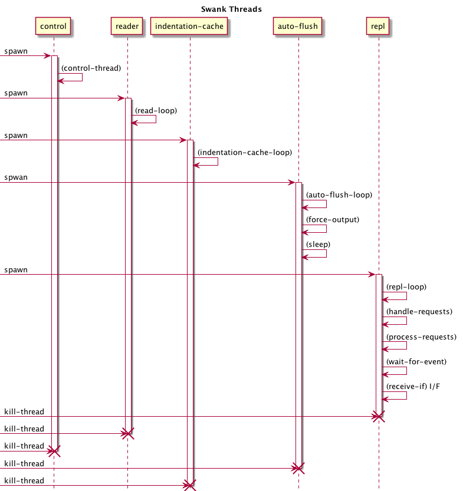

# SLIME / SWANK

## 主要な機能

(slime.el より抜粋)
>The main features are:
>- A socket-based communication/RPC interface between Emacs and Lisp, enabling introspection and remote development.
>- The `slime-mode` minor-mode complementing `lisp-mode`. This new mode includes many commands for interacting with the Common Lisp process.
>- A Common Lisp debugger written in Emacs Lisp. The debugger pops up an Emacs buffer similar to the Emacs/Elisp debugger.
>- A Common Lisp inspector to interactively look at run-time data.
>- Trapping compiler messages and creating annotations in the source file on the appropriate forms.

## 重要な概念

### Connection

TODO
(slime.el)
>"Connections" are the high-level Emacs<->Lisp networking concept.

TODO
ここに Emacs-Lisp 間のソケット通信の概念図を描く。

### Swank Server

TODO
swank サーバの概要を書く。

***

# Emacs 側

## 概要

TODO
ここに主要な Emacs 側の概念を列挙する。ライブラリ、プロセス、バッファ。

<!-- | ライブラリ | 複数の組み込みライブラリを使用 | -->
<!-- | プロセス | 複数のプロセス | -->
<!-- | バッファ | バッファ | -->

## Elisp ライブラリ

## SLIME 実行時の process およびバッファ

SLIME 実行時に以下のプロセスとバッファが存在する。

| 種別 | 名称 | 説明 | 参照方法  | 
|--------|--------|--------|--------|
| process | SLIME connection | 接続 | `slime-connection` 関数 |
| process | SLIME process | SLIME connection に対するプロセス | `slime-process` 関数 |
| buffer | ` *slime-repl xxxx` | REPL バッファ | - |
| buffer | ` *cl-connection*` | SLIME connection に関連したバッファ | - |
| buffer | `*inferior-lisp*` | SLIME process に関連したバッファ | - |
| buffer | `*slime-events*` | イベントログバッファ | `slime-events-buffer` 関数|

### SLIME connection

`slime-connection` 関数 の返り値として得られる or 変数 `slime-default-connection` 。実体はネットワーク接続。プロセスフィルタ関数として `slime-net-fileter` 関数、
プロセス監視関数として `slime-net-sentinel` 関数を持つ。

> Return the connection to use for Lisp interaction.
> Signal an error if there's no connection.

Elisp の組み込み関数 `process-contact` で詳細情報が得られる。

    ;; elisp
    (slime-connection)
    => #<process SLIME Lisp>
    ;; local
    (pp (process-contact (slime-connection) t))
    =>
    (:name "SLIME Lisp" :buffer #<buffer  *cl-connection*>
    :host "127.0.0.1" :service 49178 :nowait nil
    :remote [127 0 0 1 49178] :local  [127 0 0 1 49179]
    :filter slime-net-filter :sentinel slime-net-sentinel)

    ;; remote
    ;; xxxx は ssh tunnering に使用しているポート
    (:name "SLIME Lisp" :buffer #<buffer  *cl-connection*>
    :host "127.0.0.1" :service xxxx :nowait nil
    :remote [127 0 0 1 xxxx] :local [127 0 0 1 49188]
    :filter slime-net-filter :sentinel slime-net-sentinel)

#### _buffer_ `*cl-connection*`

TODO

SLIME connection に紐づいたバッファ。
ユーザが編集することを想定していないバッファ(バッファ名先頭にスペースあり)。

    ;; elisp
    (process-buffer (slime-connection))
    => #<buffer  *cl-connection*>

#### _function_ `slime-net-filter`

TODO

プロセス・フィルタ関数。関連付けられているプロセス(ソケット)からの標準出力を受けとる。

メッセージを処理し、 event dispatcher に渡す。

- `slime-net-filter` 関数は、以下を実行する。
    - `*cl-connection*` バッファの末尾に文字列を出力する。
    - `slime-process-available-input` 関数を実行する。
        - `slime-process-available-input` 関数は以下を実行する。
            - `*cl-connection*` バッファをカレントバッファにする。
            - 全てのメッセージの受信が終わっている場合: TODO

#### _function_ `slime-net-sentinel`

プロセス監視関数。

"Lisp connection closed unexpectedly: %s " をメッセージに出力してから
`slime-net-close` 関数を実行し、後始末をする。

#### `connection-local` variables

実体は、suffix が ":connlocal" のバッファローカル変数で、
connection 毎に異なる値を持つ。`slime-def-connection-var` マクロで定義される。

    ;; elisp
    (pp (loop for (name . value) in
       (buffer-local-variables (get-buffer " *cl-connection*"))
      if (string-match ".*:connlocal" (symbol-name name))
      collect (cons name value)))

`connection-local` 変数は、 `connection-info` I/F を呼び出すことで
Lisp 側から情報を取得し、 `slime-set-connection-info` 関数で設定される。

| 変数名 | 定義 |
|----|----|
| slime-connection-number | Serial number of a connection |
| slime-lisp-features | Lisp 側の `*features*` 変数 |
| slime-lisp-modules | Lisp 側の `*modules*` 変数 |
| slime-pid | process id |
| slime-lisp-implementation-type | Lisp 側の `lisp-implementation-type` 関数の実行結果 |
| slime-lisp-implementation-version | Lisp 側の `lisp-implementation-version` 関数の実行結果 |
| slime-lisp-implementation-name | `lisp-implementation-type-name` I/F の実行結果。デフォルトでは `lisp-implementation-type` と同じ |
| slime-lisp-implementation-program | `lisp-implementation-program` I/F の実行結果 |
| slime-connection-name | Elisp `slime-generate-connection-name` 関数の実行結果 |
| slime-inferior-process | TODO | 
| slime-communication-style | Lisp 側の `connection.communication-style` 関数 の実行結果 |
| slime-machine-instance | Lisp 側の `machine-instance` 関数の実行結果 |
| slime-connection-coding-systems | TODO lisp 側で生成 `find-external-format`  |
| slime-rex-continuations | ? TODO |
| slime-continuation-counter | ? TODO |
| slime-channels | ? TODO |
| slime-channels-counter | ? TODO |

#### _function_ `slime-connect`

TODO
> Connect to a running Swank server. Return the connection.

実行中の Swank サーバへ接続する。

### SLIME process

TODO
`slime-process` 関数の返り値として得られる。SLIME から Lisp プロセスを起動した場合と、既に起動済みの swank サーバに接続する場合とで異なる。

    ;; elisp
    (slime-process)
    => #<process inferior-lisp>  ;; local で swank を実行中の場合
    (slime-process)
    => nil ;; 既に起動済みの swank に接続した場合

### _buffer_ `*slime-events*`

変数 `slime-log-events` が `t` の場合にこのバッファにイベントがログとして出力される。

イベントは pretty print されるので、全てが出力されない場合がある。

## slime の重要な関数、マクロ (elisp)

### _function_ `slime-send`

> Send SEXP directly over the wire on the current connection.

sexp と現在の接続を引数として `slime-net-send` 関数を実行する。

### _function_ `slime-net-send`

TODO
> Send a SEXP to Lisp over the socket PROC.
> This is the lowest level of communication. The sexp will be READ and EVAL'd by Lisp.

`slime-net-send` 関数は以下を実行する。
- sexp から文字列を生成する(`slime-prin1-to-string`)。
- 文字列に改行を付与して encode し、 payload とする。
- payload の長さをエンコードし、payload とつなげて文字列を生成する。
- `process-send-string` 関数を実行する。
    - `process-send-string` 関数は、プロセスに文字列を送信する。
        500文字を超える場合は自動的に分割して送信される。

### _function_ `slime-net-read`
TODO

> Read a message from the network buffer.

`slime-net-read` 関数は以下を実行する。
- バッファの先頭に移動する。
- `slime-net-decode-length` 関数を実行する。
- TODO
- `delete-region` 関数を実行しバッファの先頭から end までをバッファから削除する。

### _function_ `slime-dispatch-event`

イベントディスパッチャ。

### _macro_ `slime-rex`

TODO

> (slime-rex (&rest SAVED-VARS)
>   (SEXP &optional (PACKAGE '(slime-current-package))
>                    (THREAD (quote slime-current-thread)))
> &rest CONTINUATIONS)

slime.el 中で多用されるマクロ。

> `slime-rex` is the RPC primitive which is used to implement both `slime-eval` and `slime-eval-async`.

> Remote EXecute SEXP.
> VARs are a list of saved variables visible in the other forms.  Each VAR is either a symbol or a list (VAR INIT-VALUE).
> SEXP is evaluated and the princed version is sent to Lisp.
> PACKAGE is evaluated and Lisp binds `*BUFFER-PACKAGE*` to this package.
> The default value is (`slime-current-package`).
> CLAUSES is a list of patterns with same syntax as `destructure-case`.
> The result of the evaluation of SEXP is dispatched on CLAUSES.
> The result is either a sexp of the form (:ok VALUE) or (:abort CONDITION).
> CLAUSES is executed asynchronously.

- `slime-dispatch-event` 関数が `(:emacs-rex form package thread continuation)` のイベントを受けとる。
    - `slime-continuation-counter` をインクリメントし `id` に束縛する。
    - `slime-send` 関数にイベントを渡す。渡すイベントは、元のイベントの continuation 部分を id に置きかえた形式。(`(:emacs-rex form package thread id)` )
    - id と continuation の組を connection-local variable として保存する。

### _function_ `slime-eval-async`
`(slime-eval-async SEXP &optional CONT PACKAGE)`
> Evaluate EXPR on the superior Lisp and call CONT with the result.

EXPR を Lisp 側で eval する。継続処理 cont が指定された場合は、
eval した結果を引数として、 cont 関数を実行する。

## RPC protocol

### パケット

16進数6桁のS-式の長さ部分とS-式本体からなる。Elisp 側では `slime-net-send` 関数が生成する。

    ;; 例
    00004c(:emacs-rex (swank:listener-eval \"9\n\")
    \"COMMON-LISP-USER\" :repl-thread 120)\n

## イベント

イベントは先頭がキーワード、残りが引数であるリストとして表現される。
キーワード名が ":emacs-" で始まるイベントは、Emacs 側で生成されたもの。
Emacs 側では `slime-dispatch-event` 関数が、
Swank 側では `dispatch-evnet` 関数がイベントを処理する。Emacs 側の処理は、
ユーザインターフェースを提供するものがある。

- `emacs-rex`
- `return`
- `debug-activate`, `debug`, `debug-return`
    debugger 関連。 `sldb-{activate,setup,exit}` 関数を実行する。TODO
- `inspect`
    `slime-open-inspector` 関数を実行する。TODO
- `eval`, `eval-no-wait`
    Emacs 側で `eval` を実行する。
- `read-from-minibuffer`, `y-or-n-p`, `ed`
    Emacs でユーザからの対話的な入力を得る。
- エラー `reader-error`, `invalid-rpc`
    Emacs でエラーを通知する。

swank 側の処理は大きく以下の 3 パターンに分けられる。

- `encode-message` 関数を実行するパターン。
    `write-string`, `debug`, `eval` 等。
- `send-event` 関数を実行するパターン
    `emacs-return`, `reader-error` 等。
- `interrupt-worker-thread` 関数を実行するパターン。`emacs-interrupt` のみ。

`encode-message` は、`write-message` 関数を実行し、現在の connection の socket-io に S-式を書く。`send-event` 関数は、 `send` I/F を実行する。

### Events

`slime-dispatch-event` 関数は `slime-event-hooks` フックによって拡張される。特に contib/slime-repl.el ファイルで
repl 周りのイベント処理が行なわれている点に注意。

|event                           | slime |repl   |presentation |  swank |
|--------------------------------|-------|---------------------|--------|
|background-message              | X     |       |             |  X     |
|channel-send                    | X     |       |             |  X     |
|debug                           | X     |       |             |  X     |
|debug-activate                  | X     |       |             |  X     |
|emacs-channel-send              | X     |       |             |  X     |
|debug-condition                 | X     |       |             |  X     |
|emacs-interrupt                 | X     |       |             |  X     |
|emacs-pong                      |       |       |             |  X     |
|emacs-rex                       | X     |       |             |  X     |
|emacs-return                    | X     |       |             |  X     |
|emacs-return-string             | X     |       |             |  X     |
|emacs-skipped-packet            | X     |       |             |        |
|debug-return                    | X     |       |             |  X     |
|ed                              | X     |       |             |  X     |
|eval                            | X     |       |             |  X     |
|eval-no-wait                    | X     |       |             |  X     |
|indentation-update              | X     |       |             |  X     |
|inspect                         | X     |       |             |  X     |
|invalid-rpc                     | X     |       |             |  X     |
|new-features                    | X     |       |             |  X     |
|new-package                     |       | X     |             |  X     |
|open-dedicated-output-stream    |       | X     |             |  X     |
|ping                            | X     |       |             |  X     |
|presentation-start              |       |       | X           |  X     |
|presentation-end                |       |       | X           |  X     |
|reader-error                    | X     |       |             |  X     |
|read-aborted                    |       | X     |             |  X     |
|read-from-minibuffer            | X     |       |             |  X     |
|read-string                     |       | X     |             |  X     |
|return                          | X     |       |             |  X     |
|test-delay                      | X     |       |             |  X     |
|write-string                    |       | X     |             |  X     |
|y-or-n-p                        | X     |       |             |  X     |

### Swank Side

TODO

## 例: C-c C-m 押下時のシーケンス

## 例: return キー押下時のシーケンス

- ユーザが return キーを押下する。
- Emacs が `slime-repl-return` 関数を実行する。
    - `slime-check-connected` 関数を実行する。接続されていない場合は error を通知する。
    - 完全なS-式の場合(`slime-input-complete-p`)、`slime-repl-send-input` 関数 を実行する。
        - バッファに改行を insert する。(TODO)
        - 入力された S-式を得る。(`slime-repl-current-input`)(TODO)
        - `slime-mark-input-start` (TODO)
        - `slime-mark-output-start` (TODO)
        - `slime-repl-send-string` 関数を実行する。
            - `slime-repl-eval-string` 関数を実行する。
                - `slime-dispatch-event` 関数に `(:emacs-rex (swank:listener-eval string)` を渡す。(`slime-rex` マクロの展開形より)
                    - 
                    - `slime-dispatch-event` は継続カウンタをインクリメントし、
                        `slime-rex-continuations` に追加する。
                    -  `slime-send` 関数を実行する。
                    - モードラインを処理する。(xemacs のみ。(`slime-recompute-modelines`))

TODO
swank 側ではコントロールスレッドが `(:emacs-rex ...)` を受けとると `thread-for-evaluation` スレッドにイベントを送信する(`repl-thread`)。
`repl-thread` は `repl-loop` 関数を実行している。
`repl-loop` 関数は `handle-requests` 関数およびその内部で `process-requests` 関数を実行する。`process-requests` 関数はループしイベントを待っている。
`repl-thread` が `(:emacs-rex ...)` イベントを受けとると `eval-for-emacs` 関数を
実行する。`eval-for-emacs` は form を `eval` した後、
`send-to-emacs` 関数を実行して結果を Emacs に返す。`(:return (:ok result))` または `(:return (:abort xxx))`。

# Swank 側

## 概要

TODO
ここに swank 側の主要な概念を列挙する。

## Common Lisp パッケージ

- `:swank`
- `:swank-io-package`
- `:swank-match`
- `:swank-rpc`
- `:swank-backend`
- `:swank-loader`
- `:swank-rpc`

<!-- - `:xref` -->

## connection

変数 `*emacs-connection*` が Emacs 側との接続を管理する。

> Connection structures represent the network connections between
> Emacs and Lisp. Each has a socket stream, a set of user I/O
> streams that redirect to Emacs, and optionally a second socket
> used solely to pipe user-output to Emacs (an optimization).  This
> is also the place where we keep everything that needs to be
> freed/closed/killed when we disconnect.

multithread 環境の場合、実体は swank.lisp で定義される `multithreaded-connection` 構造体。`connection-info` 関数で情報を得ることができる。

    ;; CL
    SWANK> (multithreaded-connection-p *emacs-connection*)
    T
    SWANK> (mconn.socket-io *emacs-connection*)
    #<SB-SYS:FD-STREAM for "socket 127.0.0.1:yyyyyy, peer: 127.0.0.1:zzzzzz" {100472C203}>
    SWANK> (connection-info)
    (:PID 28757 :STYLE :SPAWN :ENCODING
     (:CODING-SYSTEMS ("utf-8-unix" "iso-latin-1-unix")) :LISP-IMPLEMENTATION
     (:TYPE "SBCL" :NAME "sbcl" :VERSION "1.1.8" :PROGRAM "/usr/local/bin/sbcl")
     :MACHINE (:INSTANCE "xxxxxxxxx" :TYPE "X86-64" :VERSION
     "Intel(R) Core(TM)2 Duo CPU     T7700  @ 2.40GHz")
     :FEATURES ...(後略))
    :MODULES
    ("SWANK-REPL" "SWANK-ARGLISTS" "SWANK-FANCY-INSPECTOR" "SWANK-FUZZY"
     "SWANK-C-P-C" "SWANK-UTIL" "SWANK-PRESENTATIONS" "SWANK-PACKAGE-FU"
     "SWANK-MEDIA" "SB-CLTL2" "SB-INTROSPECT" "SB-BSD-SOCKETS" "SB-POSIX"
     "SB-GROVEL" "ASDF")
    :PACKAGE (:NAME "SWANK" :PROMPT "SWANK") :VERSION "2013-05-26")

TODO 構造体 multithreaded-connection について

> In multithreaded systems we delegate certain tasks to specific
> threads. The `reader-thread` is responsible for reading network
> requests from Emacs and sending them to the `control-thread`; the
> `control-thread` is responsible for dispatching requests to the
> threads that should handle them; the `repl-thread` is the one
> that evaluates REPL expressions. The control thread dispatches
> all REPL evaluations to the REPL thread and for other requests it
> spawns new threads.

TODO multithreaded-connection の生成まで。
- `accept-connections` が `make-connection` を実行。
    - `make-connection` が `make-multithreaded-connection` を実行

## Threads

変数 `*thread-list*` で管理される。`list-thread` 関数で ID、名称、 および状態を得ることができる。

     SWANK> (list-threads)
     ((:ID :NAME :STATUS)
     (4 "repl-thread" "Running")
     (5 "auto-flush-thread" "Running")
     (6 "swank-indentation-cache-thread" "Running")
     (7 "reader-thread" "Running")
     (8 "control-thread" "Running")
     (9 "Swank xxxx" "Running")
     (10 "Swank Sentinel" "Running")
     (11 "main thread" "Running"))

### SBCL での実装

スレッド関連のI/Fは、sbcl 環境では `sb-thread` パッケージの関数を用いて実装される。

|Interface | 説明 | SBCL 実装 |
|---------|--------|----------|
| initialize-multiprocessing (continuation) | マルチプロセッシングを初期化し、引数 continuation を実行する。| デフォルト |
| spawn (fn \&key name) | FN を call するスレッドを生成する。 | `sb-thread:make-thread` |
| thread-id (thread) | THREAD を識別する Emacs-parsable なオブジェクトを返す。| 実装 |
| find-thread (id) | ID に対するスレッドを返す。 | 実装 |
| thread-name (thread) | THREAD の名前を返す。 | 実装 (`sb-thread:thread-name`) |
| thread-status (thread) | THREAD の状態を文字列で返す。 | 実装 (`sb-thread:thread-alive-p`) |
| thread-attributes (thread) | plist を返す。 | デフォルト |
| current-thread | 実行中のスレッドを返す。 | 実装(`sb-thread:*current-thread*`) |
| all-threads | 全てのスレッドの(freshな)リストを返す。| 実装(`sb-thread:list-all-threads`) |
| thread-alive-p (thread) | スレッドが終了されているか判定する。| 実装(`sb-thread:thread-alive-p`) |
| interrupt-thread (thread)| Cause THREAD to execute FN.| 実装(`sb-thread:interrupt-thread`) |
| kill-thread (thread) | THREAD を即座に終了する。| 実装(`sb-thread:terminate-thread`) |
| send (thread object) | OBJECT をスレッドに送る。 | 実装 |
| receive (\&optional timeout)| Return the next message from current thread's mailbox.|デフォルト | 
| receive-if (predicate \&optional timeout) | Return the first message satisfiying PREDICATE.| 実装 |
| register-thread | ? | 実装 |
| find-registered | ? | 実装 |
| set-default-initial-binding | ? | デフォルト |
| wait-for-input (streams \&optional timeout) | ? | 実装 |

### スレッドの役割

TODO
ここに各々のスレッドについて説明を記載する。

- repl-thread
- auto-flush-thread
- swank-indentation-cache-thread
- reader-thread
- control-thread
- Swank port-number
- Swank Sentinel
- main thread

#### control-thread
TODO
control-thread は `dispatch-loop` 関数を実行する。
`dispatch-loop` 関数は 

#### auto-flush-thread

TODO
swank-repl.lisp で利用。`auto-flush-loop` 関数を見ること。

#### reader-thread

TODO
reader-thread は、connection の soket-io ストリームから S-式を読み、
control-thread に送信(`send`)する。

- `decode-message` 関数は、引数に `swank-io-package` を指定して`read-message` 関数を実行する。
    - `read-message` 関数は `read-packet` 関数を実行する。
        - `read-packet` 関数は stream からヘッダー部分を読む(`parse-header`)。
        - `read-packet` 関数は stream からヘッダーで指定された長さを読み、文字列として返す。
    - `read-message` 関数は `read-form` 関数を実行する。
        - `read-form` 関数は `*validate-input*` が `t` の場合 `validating-read` を、それ以外の場合は `read-from-string` を実行し、S-式を返す。

#### indentation-cache-thread

TODO
`indentation-cache-loop` 関数を実行する。`indentation-cache-loop` 関数は、 `receive` I/F を実行し、 `handle-indentation-cache-request` を実行する処理を繰り返す。

#### repl-thread

TODO
repl-thread と auto-flush-thread は、`create-repl` I/F で生成される。

#### auto-flush-thread

TODO
repl-thread と auto-flush-thread は、`create-repl` I/F で生成される。
- `create-repl` 関数が、 `initialize-streams-for-connection` 関数を実行する。
    - `initialize-streams-for-connection` が `open-stream` を実行する。
        - `open-stream` 関数が auto-flush-thread を生成する。
    - `spawn-repl-thread` 関数を実行し repl-thread を生成する。

`auto-flush-loop` 関数を実行する。`auto-flush-loop` 関数は、
`*auto-flush-interval*` 変数で指定された秒数(デフォルト 0.2 )毎に、
stream を `force-output` する。

#### worker-thread

TODO
`spawn-worker-thread` 関数で起動。

`thread-for-evaluation` メソッドが引数 `(multithreaded-connection t)` で呼びだされると、`spawn-worker-thread` 関数を起動する。
> Find or create a thread to evaluate the next request.

TODO `swank-backend::*mailboxes*` 変数には終了した worker thread の mailbox がたまっている??

## インターフェース

swank サーバのインターフェースはマクロ `definterface` で定義される。

定義されたインターフェースはパラメータ `swank-backend::*interfaces-functions*` で管理される。インターフェースは `defimplementation` で実装する。全てのインターフェースが実装される必要はなく、未実装のインターフェースは、パラメータ `*unimplemented-interfaces*` で管理され、起動時に警告される(`warn-unimplemented-interfaces` 関数)。

### 全インターフェース

|Category | interface|
|---------|----------|
|UTF8 | STRING-TO-UTF8 UTF8-TO-STRING|
|Codepoint length | CODEPOINT-LENGTH|
|TCP server | CREATE-SOCKET LOCAL-PORT CLOSE-SOCKET ACCEPT-CONNECTION ADD-SIGIO-HANDLER REMOVE-SIGIO-HANDLERS ADD-FD-HANDLER REMOVE-FD-HANDLERS PREFERRED-COMMUNICATION-STYLE SET-STREAM-TIMEOUT EMACS-CONNECTED|
|Unix signals | GETPID INSTALL-SIGINT-HANDLER CALL-WITH-USER-BREAK-HANDLER QUIT-LISP LISP-IMPLEMENTATION-TYPE-NAME LISP-IMPLEMENTATION-PROGRAM SOCKET-FD MAKE-FD-STREAM DUP EXEC-IMAGE COMMAND-LINE-ARGS|
|pathnames | FILENAME-TO-PATHNAME PATHNAME-TO-FILENAME DEFAULT-DIRECTORY SET-DEFAULT-DIRECTORY CALL-WITH-SYNTAX-HOOKS DEFAULT-READTABLE-ALIST|
|Compilation | CALL-WITH-COMPILATION-HOOKS SWANK-COMPILE-STRING SWANK-COMPILE-FILE FIND-EXTERNAL-FORMAT GUESS-EXTERNAL-FORMAT|
|Streams | MAKE-OUTPUT-STREAM MAKE-INPUT-STREAM|
|Documentation | ARGLIST TYPE-SPECIFIER-P FUNCTION-NAME VALID-FUNCTION-NAME-P MACROEXPAND-ALL COMPILER-MACROEXPAND-1 COMPILER-MACROEXPAND FORMAT-STRING-EXPAND DESCRIBE-SYMBOL-FOR-EMACS DESCRIBE-DEFINITION|
|Debugging | INSTALL-DEBUGGER-GLOBALLY CALL-WITH-DEBUGGING-ENVIRONMENT CALL-WITH-DEBUGGER-HOOK COMPUTE-BACKTRACE PRINT-FRAME FRAME-RESTARTABLE-P FRAME-SOURCE-LOCATION FRAME-CATCH-TAGS FRAME-LOCALS FRAME-VAR-VALUE DISASSEMBLE-FRAME EVAL-IN-FRAME FRAME-PACKAGE FRAME-CALL RETURN-FROM-FRAME RESTART-FRAME FORMAT-SLDB-CONDITION CONDITION-EXTRAS GDB-INITIAL-COMMANDS ACTIVATE-STEPPING SLDB-BREAK-ON-RETURN SLDB-BREAK-AT-START SLDB-STEPPER-CONDITION-P SLDB-STEP-INTO SLDB-STEP-NEXT SLDB-STEP-OUT|
|Definition finding | FIND-DEFINITIONS FIND-SOURCE-LOCATION BUFFER-FIRST-CHANGE |
|XREF | WHO-CALLS CALLS-WHO WHO-REFERENCES WHO-BINDS WHO-SETS WHO-MACROEXPANDS WHO-SPECIALIZES LIST-CALLERS LIST-CALLEES|
|Profiling | PROFILE PROFILED-FUNCTIONS UNPROFILE UNPROFILE-ALL PROFILE-REPORT PROFILE-RESET PROFILE-PACKAGE|
|Trace | TOGGLE-TRACE|
|Inspector | EVAL-CONTEXT DESCRIBE-PRIMITIVE-TYPE|
|Multithreading | INITIALIZE-MULTIPROCESSING SPAWN THREAD-ID FIND-THREAD THREAD-NAME THREAD-STATUS THREAD-ATTRIBUTES CURRENT-THREAD ALL-THREADS THREAD-ALIVE-P INTERRUPT-THREAD KILL-THREAD SEND RECEIVE RECEIVE-IF REGISTER-THREAD FIND-REGISTERED SET-DEFAULT-INITIAL-BINDING WAIT-FOR-INPUT|
|Locks | MAKE-LOCK CALL-WITH-LOCK-HELD|
|Weak datastructures | MAKE-WEAK-KEY-HASH-TABLE MAKE-WEAK-VALUE-HASH-TABLE HASH-TABLE-WEAKNESS|
|Character names | CHARACTER-COMPLETION-SET SAVE-IMAGE BACKGROUND-SAVE-IMAGE|

## swank の重要な関数、マクロ、構造体 (Common Lisp)

### _structure_ connection

Emacs と Lisp のネットワーク接続を表現する。

### _function_ `create-server`

TODO
> Start a SWANK server on PORT running in STYLE.
> If DONT-CLOSE is true then the listen socket will accept multiple connections,
> otherwise it will be closed after the first.

### _function_ `setup-server`

TODO

### _macro_ `defslimefun`

> The `DEFSLIMEFUN' macro defines a function that Emacs can call via RPC.

`defslimefun` マクロは Emacs が RPC で呼び出せる関数を定義するために用いられる。
実体は単なる lisp 関数となる。エクスポートされる。90関数超。

`defslimefun` に展開されるマクロ `define-stepper-function` で `sldb-step`, `sldb-next`, `sldb-out` を定義。
`symbol-status` 関数にシンボルを与えると、シンボルの状態を返す?? (FIXME)

### _macro_ `add-hook`, _function_ `run-hook`

Emacs のフック機能を Common Lisp で実現するためのマクロ。以下の Hook が定義される。

- `*new-connection-hook*`
    "This hook is run each time a connection is established"
- `*connection-closed-hook*`
    "This hook is run when a connection is closed." 
- `*pre-reply-hook*`
     "Hook run (without arguments) immediately before replying to an RPC."
- `*after-init-hook*`
     "Hook run after user init files are loaded."

### _macro_ `destructure-case`

パターンマッチマクロ。イベントの条件分岐等で用いられる。

### _function_ `decode-message`, `encode-message`

TODO
decode-message
> Read an S-expression from STREAM using the SLIME protocol.

encode-message
> Write an S-expression to STREAM using the SLIME protocol.

Event Decoding/Encoding

### _function_ `read-message`, `read-form`, `read-packet`, `parse-header`

TODO

### synonym-stream two-way-stream

TODO

### _error_ `swank-error`, `signal-swank-error`

TODO

### _error_ `end-of-repl-input`

TODO

### _condition_ `invoke-default-debugger`, function `invoke-default-debugger` 

TODO

# defslimefun で定義される function

-> RPCFunctions.md

## `ping`

tag を受けとり、返す。

## `connection-info`

> Return a key-value list of the form: 
> `(&key PID STYLE LISP-IMPLEMENTATION MACHINE FEATURES PACKAGE VERSION)`
> PID: is the process-id of Lisp process (or nil, depending on the STYLE)
> STYLE: the communication style
> LISP-IMPLEMENTATION: a list `(&key TYPE NAME VERSION)`
> FEATURES: a list of keywords
> PACKAGE: a list `(&key NAME PROMPT)`
> VERSION: the protocol version

# swank-gauche.scm 実装

swank-gauche.scm の `defslimefun` の実装状況。

## `connection-info`
## `quit-lisp`
## `swank-require`
## `create-repl`
## `listener-eval`
## `interactive-eval`
## `compile-string-for-emacs`
## `simple-completions`
## `completions`
## `set-package`
## `operator-arglist`
## `autodoc`
API の不一致あり。

## `list-all-package-names`
## `swank-macroexpand-1`
## `swank-macroexpand-all`
## `default-directory`
## `set-default-directory`
## `compile-file-if-needed`
## `load-file`
## `compile-file-for-emacs`
## `disassemble-form`
## `init-inspector`
## `inspector-nth-part`
## `inspect-nth-part`
## `inspector-reinspect`
## `inspector-toggle-verbose`
## `inspector-call-nth-action`
## `inspector-range`
## `inspector-pop`
## `inspector-next`
## `quit-inspector`
## `describe-inspectee`
## `describe-symbol`
## `describe-function`

# SLIME の起動(起動済みの swank サーバへの接続)

- `slime-connect` 関数を実行する。HOST はループバックアドレス、ポートは ssh tunneling で指定したポート。
    - `slime-connect` 関数はメッセージ "Connecting to Swank on port XXXX.." を表示する。
    - `slime-connect` 関数は `slime-net-connect` 関数を実行する。
        - `slime-net-connect` 関数は `open-network-stream` 関数を実行し、HOST への TCP 接続(プロセス)を生成する。
        - `slime-net-connect` 関数は、プロセスを `slime-net-processes` 変数へ push する。
        - `slime-net-connect` 関数は、生成した TCP 接続にプロセスフィルター `slime-net-filter`、プロセス監視関数 `slime-net-sentinel` を設定する。
        - `slime-net-connect` 関数は、 `slime-set-query-on-exit-flag` を実行する。
        - `slime-secret` があれば処理 (TODO)
        - プロセスを返す。
    - `slime-connect` 関数は、`slime-setup-connection` を実行する。
        - `slime-setup-connection` 関数は `slime-init-connection`
        関数を実行する。
            - `slime-init-connection` 関数は、`slime-connection-counter` を 0 にする。(TODO 条件あり)
            - `slime-init-connection` 関数は、`slime-buffer-connection` を設定する。(TODO)
            - `slime-connection-number` を `slime-connection-counter` + 1 に設定する。(TODO)
            - `slime-eval-async` 関数に `(swank:connection-info)` を渡す。
            - `slime-set-connection-info` 関数を実行する。(TODO)
            
        - `slime-init-connection` 関数は `slime-select-connection` 関数を実行する。(TODO)

# SWANK サーバの起動と停止

TODO
`start-server`, `stop-server`, `restart-server`

## SWANK サーバ起動の概要

- swank-loader.lisp を `load` する。
- `swank-loader:init` 関数に必要なパラメータを渡す。
- `swank:create-server` 関数を実行する。
    - `swank:setup-server` 関数を実行する。
        - `*log-output*` を初期化する(`init-log-output` 関数)。
        - ソケットを生成する(`sb-bsd-sockets:inet-socket` 関数)。
        - `announce-fn` を実行する(`funcall`)。
        - `initialize-multiprocessing` I/F 関数を実行する。
            - `start-sentinel` 関数を実行する。
                - スレッド "Swank Sentinel" を生成する(`spawn` I/F)。
            - スレッド "Swank ソケットのポート番号" を生成する(`spawn` I/F)。
            - `serve-loop` 関数を実行する。

`serve-loop` 関数は以下の通り。

- `note` ローカル関数を実行する。
    - `send-to-sentinel` 関数を実行し sentinel スレッドに `add-server` メッセージを送信する。
        - sentinel スレッドはメッセージを受けとり、ソケット、ポート番号、現在のスレッド = Swank port number スレッド、を `*servers*` 変数に push する。
- `serve` ローカル関数を繰り返し実行する。(TODO)
    - `accept-connections` 関数を実行する。(TODO)

## _variable_ `*communication-style*`

通信方法を管理する。

デフォルトの `*communication-style*` は、`preferred-communication-style` によって決定される。シンボル `:sb-thread` が `*features*` 変数内にあれば、 `:spawn` となる。

## _variable_ `*connections*`
TODO

> List of all active connections, with the most recent at the front.

## _variable_ `*servers*`
TODO
> A list ((server-socket port thread) ...) describing the listening sockets.
> Used to close sockets on server shutdown or restart.

## _function_ `ping-pong`

TODO
`send-to-emacs` の例。Lisp から `(:ping id tag)` を送信し、`(:emacs-pong tag)` イベントを待つ。
`maybe-slow-down` 関数は `*send-counter*` が 100 を超えると、0 に戻した上で `ping-pong` 関数を実行する。

# ./contrib/swank-media

TODO

