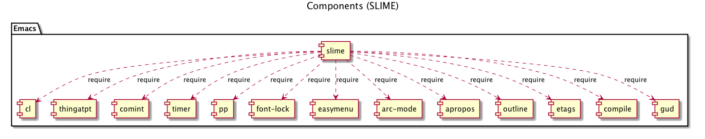
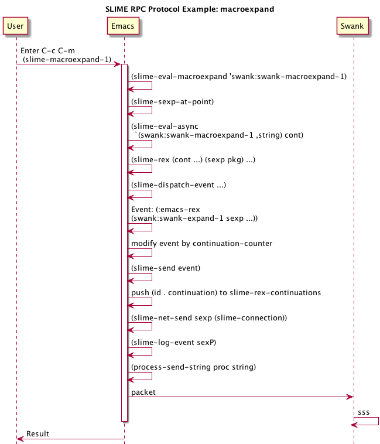
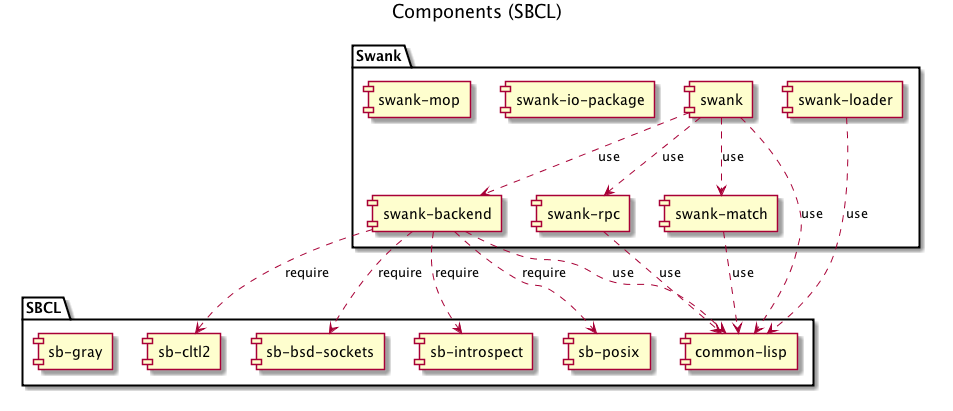
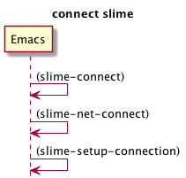
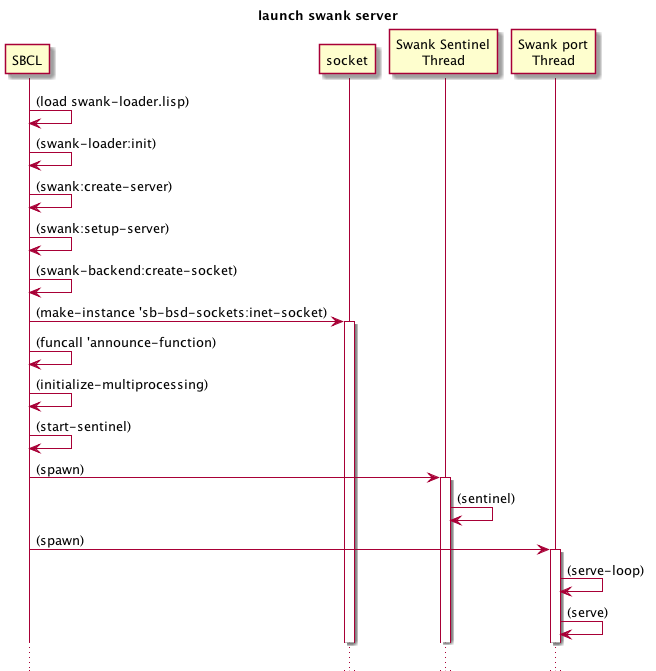

# SLIME / SWANK

# Emacs 側

## 概要

TODO ここに主要な Emacs 側の概念を列挙する。

<!-- | ライブラリ | 複数の組み込みライブラリを使用 | -->
<!-- | プロセス | 複数のプロセス | -->
<!-- | バッファ | バッファ | -->

## Elisp ライブラリ

## SLIME 実行時の process およびバッファ

SLIME 実行時に以下のプロセスとバッファが存在する。

| 種別 | 名称 | 説明 | 参照方法  | 
|--------|--------|--------|--------|
| process | SLIME connection | 接続 | `slime-connection` 関数 |
| process | SLIME process | SLIME connection に対するプロセス | `slime-process` 関数 |
| buffer | ` *slime-repl xxxx` | REPL バッファ | - |
| buffer | ` *cl-connection*` | SLIME connection に関連したバッファ | - |
| buffer | `*inferior-lisp*` | SLIME process に関連したバッファ | - |
| buffer | `*slime-events*` | イベントログバッファ | `slime-events-buffer` 関数|

### SLIME connection

`slime-connection` 関数 の返り値として得られる or 変数 `slime-default-connection` 。実体はネットワーク接続。プロセスフィルタ関数として `slime-net-fileter` 関数、
プロセス監視関数として `slime-net-sentinel` 関数を持つ。

Elisp の組み込み関数 `process-contact` で詳細情報が得られる。

    ;; elisp
    (slime-connection)
    => #<process SLIME Lisp>
    ;; local
    (pp (process-contact (slime-connection) t))
    =>
    (:name "SLIME Lisp" :buffer #<buffer  *cl-connection*>
    :host "127.0.0.1" :service 49178 :nowait nil
    :remote [127 0 0 1 49178] :local  [127 0 0 1 49179]
    :filter slime-net-filter :sentinel slime-net-sentinel)

    ;; remote
    ;; xxxx は ssh tunnering に使用しているポート
    (:name "SLIME Lisp" :buffer #<buffer  *cl-connection*>
    :host "127.0.0.1" :service xxxx :nowait nil
    :remote [127 0 0 1 xxxx] :local [127 0 0 1 49188]
    :filter slime-net-filter :sentinel slime-net-sentinel)

#### `*cl-connection*` バッファ

TODO

SLIME connection に紐づいたバッファ。
ユーザが編集することを想定していないバッファ(バッファ名先頭にスペースあり)。

    ;; elisp
    (process-buffer (slime-connection))
    => #<buffer  *cl-connection*>

#### `slime-net-filter` 関数

TODO

プロセス・フィルタ関数。関連付けられているプロセス(ソケット)からの標準出力を受けとる。

メッセージを処理し、 event dispatcher に渡す。

- `slime-net-filter` 関数は、以下を実行する。
    - `*cl-connection*` バッファの末尾に文字列を出力する。
    - `slime-process-available-input` 関数を実行する。
        - `slime-process-available-input` 関数は以下を実行する。
            - `*cl-connection*` バッファをカレントバッファにする。
            - 全てのメッセージの受信が終わっている場合: TODO

#### `slime-net-sentinel` 関数

プロセス監視関数。

"Lisp connection closed unexpectedly: %s " をメッセージに出力してから `slime-net-close` 関数を実行し、後始末をする。

#### `connection-local` 変数

実体は、suffix が ":connlocal" のバッファローカル変数で、
connection 毎に異なる値を持つ。`slime-def-connection-var` マクロで定義される。

    ;; elisp
    (pp (loop for (name . value) in
       (buffer-local-variables (get-buffer " *cl-connection*"))
      if (string-match ".*:connlocal" (symbol-name name))
      collect (cons name value)))

`connection-local` 変数は、 `connection-info` I/F を呼び出すことで
Lisp 側から情報を取得し、 `slime-set-connection-info` 関数で設定される。

| 変数名 | 定義 |
|----|----|
| slime-connection-number | Serial number of a connection |
| slime-lisp-features | Lisp 側の `*features*` 変数 |
| slime-lisp-modules | Lisp 側の `*modules*` 変数 |
| slime-pid | process id |
| slime-lisp-implementation-type | Lisp 側の `lisp-implementation-type` 関数の実行結果 |
| slime-lisp-implementation-version | Lisp 側の `lisp-implementation-version` 関数の実行結果 |
| slime-lisp-implementation-name | `lisp-implementation-type-name` I/F の実行結果。デフォルトでは `lisp-implementation-type` と同じ |
| slime-lisp-implementation-program | `lisp-implementation-program` I/F の実行結果 |
| slime-connection-name | Elisp `slime-generate-connection-name` 関数の実行結果 |
| slime-inferior-process | TODO | 
| slime-communication-style | Lisp 側の `connection.communication-style` 関数 の実行結果 |
| slime-machine-instance | Lisp 側の `machine-instance` 関数の実行結果 |
| slime-connection-coding-systems | TODO lisp 側で生成 `find-external-format`  |
| slime-rex-continuations | ? |
| slime-continuation-counter | ? |
| slime-channels | ? |
| slime-channels-counter | ? |

#### `slime-connect` 関数

TODO

Swank サーバへ接続する。

### SLIME process

TODO
`slime-process` 関数の返り値として得られる。SLIME から Lisp プロセスを起動した場合と、既に起動済みの swank サーバに接続する場合とで異なる。

    ;; elisp
    (slime-process)
    => #<process inferior-lisp>  ;; local で swank を実行中の場合
    (slime-process)
    => nil ;; 既に起動済みの swank に接続した場合

### `*slime-events*` バッファ

変数 `slime-log-events` が `t` の場合にこのバッファにイベントがログとして出力される。

イベントは pretty print されるので、全てが出力されない場合がある。

## slime の重要な関数、マクロ (elisp)

### `slime-send` 関数

`slime-net-send` を実行する。

### `slime-net-send` 関数

TODO
`slime-prin1-to-string` 関数で header と payload を作成する。

### `slime-net-read` 関数

パケットを read し、 S-式を返す。その後、読んだ部分をバッファから削除する。

### `slime-dispatch-event` 関数

TODO

(:emacs-rex form package thread continuation) のイベントを受けとると、continuation の代わりに incf した slime-continuation-counter を slime-send する。 (:emacs-rex form package thread id)
そのうえで、 id と continuation の組を connection-local variable として保存する。

### `slime-rex` マクロ

TODO

## RPC protocol

### パケット

16進数6桁のS-式の長さ部分とS-式本体からなる。`slime-net-send` 関数が生成する。

    ;; 例
    00004c(:emacs-rex (swank:listener-eval \"9\n\")
    \"COMMON-LISP-USER\" :repl-thread 120)\n

## イベント

先頭がキーワードであるリスト。キーワード名が ":emacs-" で始まるイベントは、Emacs 側で生成されたもの。

## 例: C-c C-m 押下時のシーケンス図

# Swank 側

## 概要

TODO ここに swank 側の主要な概念を列挙する。

## Common Lisp パッケージ

- `:swank`
- `:swank-io-package`
- `:swank-match`
- `:swank-rpc`
- `:swank-backend`
- `:swank-loader`
- `:swank-rpc`
<!-- - `:pxref` -->

## connection

変数 `*emacs-connection*` が Emacs 側との接続を管理する。multithread 環境の場合、実体は swank.lisp で定義される構造体 `multithreaded-connection`。`connection-info` 関数で情報を得ることができる。

    ;; CL
    SWANK> (multithreaded-connection-p *emacs-connection*)
    T
    SWANK> (mconn.socket-io *emacs-connection*)
    #<SB-SYS:FD-STREAM for "socket 127.0.0.1:yyyyyy, peer: 127.0.0.1:zzzzzz" {100472C203}>
    SWANK> (connection-info)
    (:PID 28757 :STYLE :SPAWN :ENCODING
     (:CODING-SYSTEMS ("utf-8-unix" "iso-latin-1-unix")) :LISP-IMPLEMENTATION
     (:TYPE "SBCL" :NAME "sbcl" :VERSION "1.1.8" :PROGRAM "/usr/local/bin/sbcl")
     :MACHINE (:INSTANCE "xxxxxxxxx" :TYPE "X86-64" :VERSION
     "Intel(R) Core(TM)2 Duo CPU     T7700  @ 2.40GHz")
     :FEATURES ...(後略))
    :MODULES
    ("SWANK-REPL" "SWANK-ARGLISTS" "SWANK-FANCY-INSPECTOR" "SWANK-FUZZY"
     "SWANK-C-P-C" "SWANK-UTIL" "SWANK-PRESENTATIONS" "SWANK-PACKAGE-FU"
     "SWANK-MEDIA" "SB-CLTL2" "SB-INTROSPECT" "SB-BSD-SOCKETS" "SB-POSIX"
     "SB-GROVEL" "ASDF")
    :PACKAGE (:NAME "SWANK" :PROMPT "SWANK") :VERSION "2013-05-26")

## Threads

変数 `*thread-list*` で管理される。`list-thread` 関数で ID、名称、 および状態を得ることができる。

     SWANK> (list-threads)
     ((:ID :NAME :STATUS)
     (4 "repl-thread" "Running")
     (5 "auto-flush-thread" "Running")
     (6 "swank-indentation-cache-thread" "Running")
     (7 "reader-thread" "Running")
     (8 "control-thread" "Running")
     (9 "Swank xxxx" "Running")
     (10 "Swank Sentinel" "Running")
     (11 "main thread" "Running"))

### SBCL での実装

スレッド関連のI/Fは、sbcl 環境では `sb-thread` パッケージの関数を用いて実装されている。

|Interface | 説明 | SBCL 実装 |
|---------|--------|----------|
| initialize-multiprocessing (continuation) | マルチプロセッシングを初期化し、引数 continuation を実行する。| デフォルト |
| spawn (fn \&key name) | FN を call するスレッドを生成する。 | `sb-thread:make-thread` |
| thread-id (thread) | THREAD を識別する Emacs-parsable なオブジェクトを返す。| 実装 |
| find-thread (id) | ID に対するスレッドを返す。 | 実装 |
| thread-name (thread) | THREAD の名前を返す。 | 実装 (`sb-thread:thread-name`) |
| thread-status (thread) | THREAD の状態を文字列で返す。 | 実装 (`sb-thread:thread-alive-p`) |
| thread-attributes (thread) | plist を返す。 | デフォルト |
| current-thread | 実行中のスレッドを返す。 | 実装(`sb-thread:*current-thread*`) |
| all-threads | 全てのスレッドの(freshな)リストを返す。| 実装(`sb-thread:list-all-threads`) |
| thread-alive-p (thread) | スレッドが終了されているか判定する。| 実装(`sb-thread:thread-alive-p`) |
| interrupt-thread (thread)| Cause THREAD to execute FN.| 実装(`sb-thread:interrupt-thread`) |
| kill-thread (thread) | THREAD を即座に終了する。| 実装(`sb-thread:terminate-thread`) |
| send (thread object) | OBJECT をスレッドに送る。 | 実装 |
| receive (\&optional timeout)| Return the next message from current thread's mailbox.|デフォルト | 
| receive-if (predicate \&optional timeout) | Return the first message satisfiying PREDICATE.| 実装 |
| register-thread | ? | 実装 |
| find-registered | ? | 実装 |
| set-default-initial-binding | ? | デフォルト |
| wait-for-input (streams \&optional timeout) | ? | 実装 |

### スレッドの役割

TODO

- repl-thread
- auto-flush-thread
- swank-indentation-cache-thread
- reader-thread
- control-thread
- Swank port-number
- Swank Sentinel
- main thread

#### control-thread

`send-to-emacs` の送信先。

## インターフェース

swank サーバのインターフェースはマクロ `definterface` で定義される。定義されたインターフェースはパラメータ `swank-backend::*interfaces-functions*` で管理される。インターフェースは `defimplementation` で実装する。全てのインターフェースが実装される必要はなく、未実装のインターフェースは、パラメータ `*unimplemented-interfaces*` で管理され、起動時に警告される(`warn-unimplemented-interfaces` 関数)。

### 全インターフェース

|Category | interface|
|---------|----------|
|UTF8 | STRING-TO-UTF8 UTF8-TO-STRING|
|Codepoint length | CODEPOINT-LENGTH|
|TCP server | CREATE-SOCKET LOCAL-PORT CLOSE-SOCKET ACCEPT-CONNECTION ADD-SIGIO-HANDLER REMOVE-SIGIO-HANDLERS ADD-FD-HANDLER REMOVE-FD-HANDLERS PREFERRED-COMMUNICATION-STYLE SET-STREAM-TIMEOUT EMACS-CONNECTED|
|Unix signals | GETPID INSTALL-SIGINT-HANDLER CALL-WITH-USER-BREAK-HANDLER QUIT-LISP LISP-IMPLEMENTATION-TYPE-NAME LISP-IMPLEMENTATION-PROGRAM SOCKET-FD MAKE-FD-STREAM DUP EXEC-IMAGE COMMAND-LINE-ARGS|
|pathnames | FILENAME-TO-PATHNAME PATHNAME-TO-FILENAME DEFAULT-DIRECTORY SET-DEFAULT-DIRECTORY CALL-WITH-SYNTAX-HOOKS DEFAULT-READTABLE-ALIST|
|Compilation | CALL-WITH-COMPILATION-HOOKS SWANK-COMPILE-STRING SWANK-COMPILE-FILE FIND-EXTERNAL-FORMAT GUESS-EXTERNAL-FORMAT|
|Streams | MAKE-OUTPUT-STREAM MAKE-INPUT-STREAM|
|Documentation | ARGLIST TYPE-SPECIFIER-P FUNCTION-NAME VALID-FUNCTION-NAME-P MACROEXPAND-ALL COMPILER-MACROEXPAND-1 COMPILER-MACROEXPAND FORMAT-STRING-EXPAND DESCRIBE-SYMBOL-FOR-EMACS DESCRIBE-DEFINITION|
|Debugging | INSTALL-DEBUGGER-GLOBALLY CALL-WITH-DEBUGGING-ENVIRONMENT CALL-WITH-DEBUGGER-HOOK COMPUTE-BACKTRACE PRINT-FRAME FRAME-RESTARTABLE-P FRAME-SOURCE-LOCATION FRAME-CATCH-TAGS FRAME-LOCALS FRAME-VAR-VALUE DISASSEMBLE-FRAME EVAL-IN-FRAME FRAME-PACKAGE FRAME-CALL RETURN-FROM-FRAME RESTART-FRAME FORMAT-SLDB-CONDITION CONDITION-EXTRAS GDB-INITIAL-COMMANDS ACTIVATE-STEPPING SLDB-BREAK-ON-RETURN SLDB-BREAK-AT-START SLDB-STEPPER-CONDITION-P SLDB-STEP-INTO SLDB-STEP-NEXT SLDB-STEP-OUT|
|Definition finding | FIND-DEFINITIONS FIND-SOURCE-LOCATION BUFFER-FIRST-CHANGE |
|XREF | WHO-CALLS CALLS-WHO WHO-REFERENCES WHO-BINDS WHO-SETS WHO-MACROEXPANDS WHO-SPECIALIZES LIST-CALLERS LIST-CALLEES|
|Profiling | PROFILE PROFILED-FUNCTIONS UNPROFILE UNPROFILE-ALL PROFILE-REPORT PROFILE-RESET PROFILE-PACKAGE|
|Trace | TOGGLE-TRACE|
|Inspector | EVAL-CONTEXT DESCRIBE-PRIMITIVE-TYPE|
|Multithreading | INITIALIZE-MULTIPROCESSING SPAWN THREAD-ID FIND-THREAD THREAD-NAME THREAD-STATUS THREAD-ATTRIBUTES CURRENT-THREAD ALL-THREADS THREAD-ALIVE-P INTERRUPT-THREAD KILL-THREAD SEND RECEIVE RECEIVE-IF REGISTER-THREAD FIND-REGISTERED SET-DEFAULT-INITIAL-BINDING WAIT-FOR-INPUT|
|Locks | MAKE-LOCK CALL-WITH-LOCK-HELD|
|Weak datastructures | MAKE-WEAK-KEY-HASH-TABLE MAKE-WEAK-VALUE-HASH-TABLE HASH-TABLE-WEAKNESS|
|Character names | CHARACTER-COMPLETION-SET SAVE-IMAGE BACKGROUND-SAVE-IMAGE|

## swank の重要な関数、マクロ、構造体 (Common Lisp)

### connection 構造体

Emacs と Lisp のネットワーク接続を表現する。

### `defslimefun` マクロ

「Emacs が RPC で呼び出せる関数を定義」する。実体は単なる lisp 関数。エクスポートされる。90関数超。
 `defslimefun` に展開されるマクロ `define-stepper-function` で `sldb-step`, `sldb-next`, `sldb-out` を定義。
`symbol-status` 関数にシンボルを与えると、シンボルの状態を返す?? (FIXME)

### `add-hook` マクロ、 `run-hook` 関数

Emacs の `add-hook`, `run-hook` 相当を CL で実現するためのマクロ。

### `destructure-case` マクロ

パターンマッチ。

### `decode-message` 関数、`encode-message` 関数

TODO

Event Decoding/Encoding

### `read-message` 関数、`read-form` 関数、`read-packet` 関数、`parse-header` 関数

TODO

### synonym-stream two-way-stream
TODO

### `swank-error` error

TODO

### `end-of-repl-input` error
TODO

### `invoke-default-debugger` コンディション
TODO

# SLIME の起動(起動済みの swank サーバへの接続)

- `slime-connect` 関数を実行する。host はループバックアドレス、ポートは ssh tunneling で指定したポート。
    - `slime-connect` 関数はメッセージ "Connecting to Swank on port XXXX.." を表示する。
    - `slime-connect` 関数は `slime-net-connect` 関数を実行し、process を生成する。
        - `slime-net-connect` 関数は `open-network-stream` 関数を実行し、HOST への TCP 接続を生成する。
        - `slime-net-connect` 関数は、プロセスを `slime-net-processes` 変数へ push する。
        - `slime-net-connect` 関数は、生成した TCP 接続にプロセスフィルター、プロセス監視関数を設定する。
        - `slime-net-connect` 関数は、 `slime-set-query-on-exit-flag` を実行する。
        - `slime-secret` があれば処理 (TODO)
        - プロセスを返す

# SWANK サーバの起動 

TODO

## SWANK サーバ起動の概要

- swank-loader.lisp を `load` する。
- `swank-loader:init` 関数に必要なパラメータを渡す。
- `swank:create-server` 関数を実行する。
    - `swank:setup-server` 関数を実行する。
        - `*log-output*` を初期化する(`init-log-output` 関数)。
        - ソケットを生成する(`sb-bsd-sockets:inet-socket` 関数)。
        - `announce-fn` を実行する(`funcall`)。
        - `initialize-multiprocessing` I/F 関数を実行する。
            - `start-sentinel` 関数を実行する。
                - スレッド "Swank Sentinel" を生成する(`spawn` I/F)。
            - スレッド "Swank ソケットのポート番号" を生成する(`spawn` I/F)。

## `*communication-style*` 変数

Swank と Lisp の通信方法を管理する。デフォルトの `*communication-style*` は、`preferred-communication-style` によって決定される。シンボル `:sb-thread` が `*features*` 変数内にあれば、 `:spawn` となる。

## `ping-pong` 関数

TODO
`send-to-emacs` の例。Lisp から `(:ping id tag)` を送信し、`(:emacs-pong tag)` イベントを待つ。
`maybe-slow-down` 関数は `*send-counter*` が 100 を超えると、0 に戻した上で `ping-pong` 関数を実行する。

# ./contrib/swank-media

TODO

