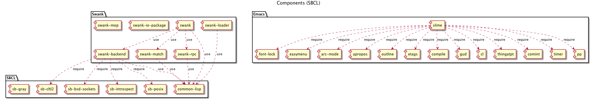

# コンポーネント

FIXME

# Emacs 側

## SLIME 実行時の process およびバッファ

- SLIME connection  (slime-connection) の返り値
- SLIME process (slime-process) の返り値
- \*slime-events\* バッファ

Emacs のスクラッチバッファで確認できる。

    (slime-connection)
    => #<process SLIME Lisp>
    (slime-process)
    => #<process inferior-lisp>  ;; local で swank を実行中の場合
    (slime-process)
    => nil ;; 既に起動済みの swank に接続した場合

### SLIME connection

実体はネットワーク接続。Elisp のプロセス関連関数 #'process-contact で詳細情報が得られる。

    ;; local
    (pp (process-contact (slime-connection) t))
    =>
    (:name "SLIME Lisp" :buffer #<buffer  *cl-connection*>
    :host "127.0.0.1" :service 49178 :nowait nil
    :remote [127 0 0 1 49178] :local  [127 0 0 1 49179]
    :filter slime-net-filter :sentinel slime-net-sentinel)

    ;; remote
    ;; xxxx は ssh tunnering に使用しているポート
    (:name "SLIME Lisp" :buffer #<buffer  *cl-connection*>
    :host "127.0.0.1" :service xxxx :nowait nil
    :remote [127 0 0 1 xxxx] :local [127 0 0 1 49188]
    :filter slime-net-filter :sentinel slime-net-sentinel)

#### buffer *cl-connection*

SLIME connection に紐づいたバッファ。バッファ名は先頭にスペースあり。

    (process-buffer (slime-connection))
    => #<buffer  *cl-connection*>

#### slime-net-filter

process filter.
メッセージを処理し、 event dispatcher に渡す。

- \*cl-connection\* バッファに受けとったメッセージを出力する。
- メッセージを全て受けとった場合、メッセージを read する。
- event 

#### process sentinel

slime-net-sentinel.
"Lisp connection closed unexpectedly: %s " をメッセージに出力し、後始末をする。

#### connection-local 変数

connection 毎に異なる値を持つ connection-local な変数が使われる。実体は、suffix が ":connlocal" のバッファローカル変数。slime-def-connection-var マクロで定義される。

    (pp (loop for (name . value) in
       (buffer-local-variables (get-buffer " *cl-connection*"))
      if (string-match ".*:connlocal" (symbol-name name))
      collect (cons name value)))
    =>

- slime-connection-number
- slime-lisp-features
- slime-lisp-modules
- slime-pid
- slime-lisp-implementation-type
- slime-lisp-implementation-version
- slime-lisp-implementation-name
- slime-lisp-implementation-program
- slime-connection-name
- slime-inferior-process
- slime-communication-style
- slime-machine-instance
- slime-connection-coding-systems

- slime-rex-continuations
- slime-continuation-counter
- slime-channels
- slime-channels-counter

### SLIME process

### \*slime-events\* バッファ

ログ。
変数 slime-log-events が t の場合にこのバッファにイベントが出力される。
ただし、イベントは pretty print され、全てが出力されない場合がある。

## SLIME の重要な関数 (elisp)

### slime-send 関数

slime-net-send

### slime-net-send 関数

slime-prin1-to-string で header と payload を作成する。

### slime-net-read 関数

パケットを read し、 S-式を返す。その後、読んだ部分のバッファをクリアする。

### slime-dispatch-event 関数

(:emacs-rex form package thread continuation) のイベントを受けとると、continuation の代わりに incf した slime-continuation-counter を slime-send する。 (:emacs-rex form package thread id)
そのうえで、 id と continuation の組を connection-local variable として保存する。

### slime-rex マクロ

## RPC protocol

### パケット

16進数6桁のS-式の長さ部分とS-式本体からなる。slime-net-send 関数が生成する。

    ;; 例
    00004c(:emacs-rex (swank:listener-eval \"9\n\")
    \"COMMON-LISP-USER\" :repl-thread 120)\n

## イベント

先頭がキーワードであるリスト。キーワード名が ":emacs-" で始まるイベントは、Emacs 側で生成されたもの。

## 例: C-c C-m 押下時のシーケンス図

# Swank 側

## パッケージ

- \:swank
- \:swank-io-package
- \:swank-match
- \:swank-rpc
- \:swank-backend

## connection
変数 \*emacs-connection\* が Emacs 側との接続を管理する。multithread 環境の場合、実体は swank.lisp で定義される構造体 multithreaded-connection。

    SWANK> (multithreaded-connection-p *emacs-connection*)
    T
    SWANK> (mconn.socket-io *emacs-connection*)
    #<SB-SYS:FD-STREAM for "socket 127.0.0.1:62279, peer: 127.0.0.1:62280" {100472C203}>
    SWANK> 

